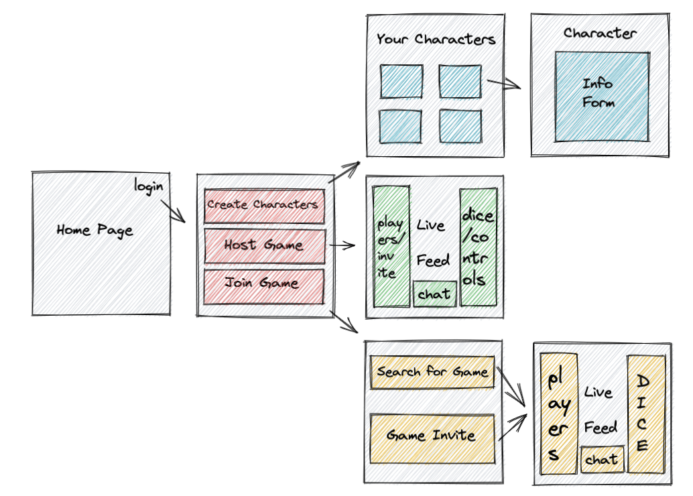
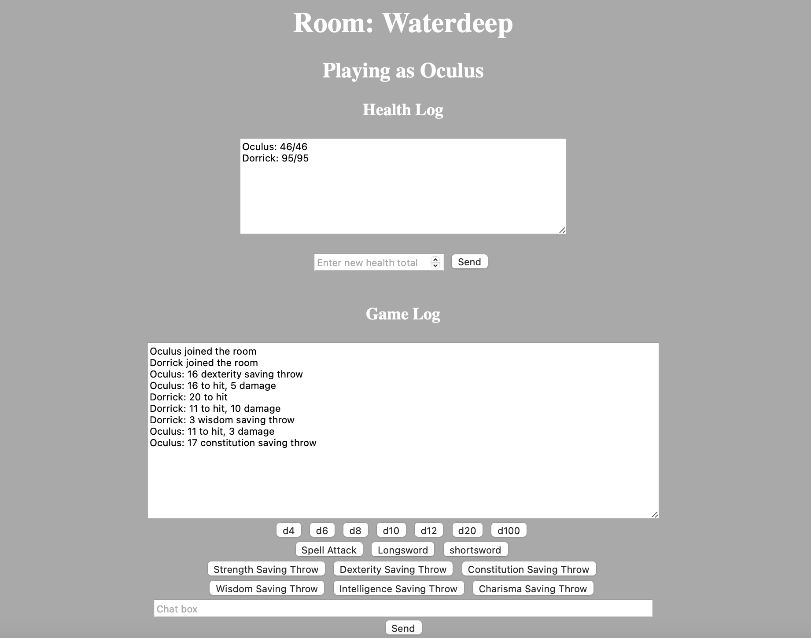
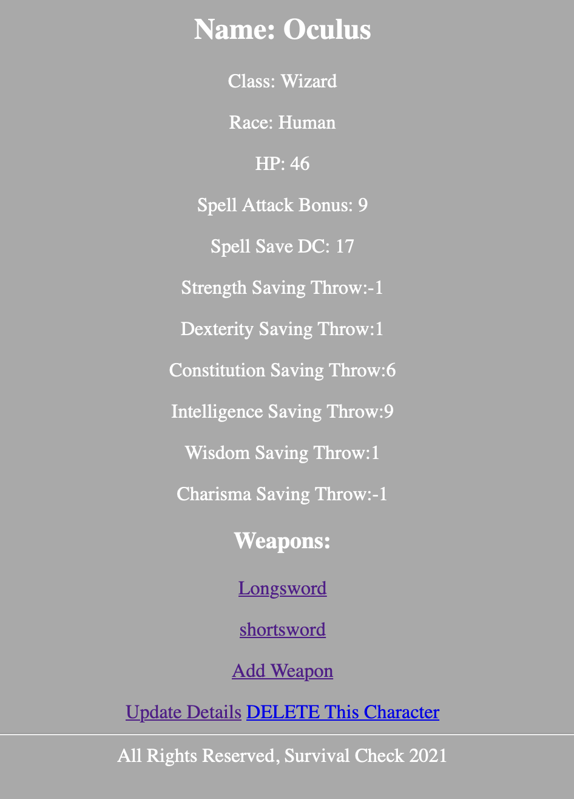

# Survival Check
Survival Check is an app created to help track your D&D combats online. Using Django it allows players to create multiple characters and their individual weapons and then hop into a game room with their dungeon master. Once in a game room everyone can see eachothers health, attacks, messages, and more. 

## `Give it a Try`
* <a href="https://survival-check.herokuapp.com/">The live site is currently undeer maintanence</a>
* Follow these installation instructions
    * clone the repo and run it
    * run npm install
    * connect to the backend
    * run python3 manage.py runserver

## `User Stories`
- Many Users can join the same game together 
- The users can see each others rolls 
- All rolls automatically have their character's bonuses applied 
- User can post live comments 
- A live update on health for all characters

## Wire Frame
This is the original plan for how the site would be connected and a rough layout of its look.


## `Technology of the Website`

### The Live Game

#### The Page:


#### The Code:
```
        const roomName = JSON.parse(document.getElementById('room-name').textContent);
        const characterName = JSON.parse(document.getElementById('character-name').textContent);
        const characterHealth = JSON.parse(document.getElementById('character-hp').textContent);
         
        const scroll =function(e) {
            document.getElementById("chat-log").scrollTop = document.getElementById("chat-log").scrollHeight
        }

        const chatSocket =new WebSocket(
            'ws://'
            + window.location.host
            + '/ws/room/'
            + roomName
            + '/'
        );

        chatSocket.onopen =function(e) {
            chatSocket.send(JSON.stringify({
                'message': characterName + ' joined the room',
                'weapon': false,
                'save' : false,
                'spell': false,
                'top-location': false
            }));
            chatSocket.send(JSON.stringify({
                'message': characterName + ': ' + characterHealth + '/' + characterHealth,
                'weapon': false,
                'save' : false,
                'spell': false,
                'top-location': true
            }));
        }
```

#### The Explanation:
This is the page that allows multiple users to see a live update of the game. It parses some of the data on the page in order to get important informatin about the users so it can refer to them. It also create a socket which acts as the live update section of the page so that users can see other users' comments and rolls. And the onopen function is an example of how it sends a message into the appropiate box when someone sends a message to the server. 

### Character Creation
#### The Page:

#### The Code:
```

    <h2>Name: {{character.name}}</h2>
    <p>Class: {{character.character_class}}</p>
    <p>Race: {{character.race}}</p>
    <p>HP: {{character.hit_points}}</p>
    <p>Spell Attack Bonus: {{character.spell_attack_bonus}}</p>
    <p>Spell Save DC: {{character.spell_save_dc}}</p>
    <p>Strength Saving Throw:{{character.strength_saving_throw}}</p> 
    <p>Dexterity Saving Throw:{{character.dexterity_saving_throw}} </p>
    <p>Constitution Saving Throw:{{character.constitution_saving_throw}} </p>
    <p>Intelligence Saving Throw:{{character.intelligence_saving_throw}}</p>
    <p>Wisdom Saving Throw:{{character.wisdom_saving_throw}}</p>
    <p>Charisma Saving Throw:{{character.charisma_saving_throw}}</p>
    <h3>Weapons:</h3>
    
        <a href="/weapon/{{weapon.id}}">
            <p>{{ weapon.name }}</p>
        </a>        
     
    <a href="/weapon/create">
        <p>Add Weapon</p>
    </a>  

    <a href="">Update Details</a>
    <a href="">DELETE This Character</a>

    <hr>

<div class="row">

</div>


```
#### The Explanation:
This page shows all of the informatino for a selected character. It uses {{}} to reference to a variable throughoiut the page to get the correct data that it needs to display. I also use a for loop with hrefs attached to list all of the weapons that have been created for this character with hyperlinks to the weapon pages. 

## Major Hurdles
* A large blocker that I ran into was getting the game page to be live updated for multiple users. I used redis and scripts to send the messages across multiple users sites.
* Another hurdle I faced was modifying the forms that Django automatically generates. I was able to figure out how to get around those limitations and apply the changes to the style and options in my forms. 